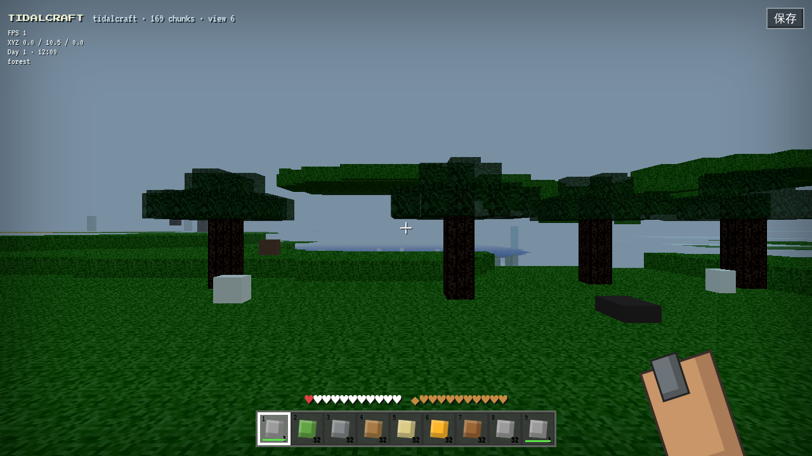

# TidalCraft

TidalCraft 是一个完全使用 Web 技术制作的原创第一人称 3D 体素生存游戏，视觉与玩法向 2018 年前后的方块沙盒和水域探索致意。它不是 Minecraft，也不包含、提取或重新分发 Mojang/Microsoft 的代码、纹理、模型、声音或商标素材。



## 立即游玩

合并到 `main` 并在仓库设置中将 Pages Source 设为 **GitHub Actions** 后，公开地址为：

`https://wuswufei0409.github.io/test3/`

桌面 Chromium：点击“进入世界”，允许指针锁定。WASD 移动，鼠标观察，左键持续挖掘、右键放置，F 使用/进食/射击，空格跳跃/游泳，Shift 疾跑，C 下蹲，E 背包/配方册，1–9 选快捷栏，Q 丢弃一件物品。

## 本地开发与验证

需要 Node.js 22+：

```bash
npm ci
npm run dev
npm test
npm run build
npm run preview
npm run test:e2e
npm run test:perf
```

`npm test` 覆盖固定种子、背包容量与堆叠、配置式合成、木→石→铁工具门槛、挖掘速度、饥饿/溺水、作物 tick、四种三叉戟效果和损坏存档回退。`test:e2e` 验证真实 WebGL 场景、169 chunks、30 实体与零控制台错误。`test:perf` 会在当前机器跑满五分钟，并按平均 FPS ≥30、P95 帧时间 ≤50ms 判定。CI 会依次运行测试、生产构建、固定入口冒烟，再发布 Pages。

## 架构

- `src/data.js`：方块、物品及配方的配置数据；共 38 种可区分方块。
- `src/sim.js`：可确定复现的世界函数、背包/制作、工具等级、生存 tick、农作物、三叉戟规则、存档校验。此层不依赖 DOM，便于自动测试。
- `src/main.js`：Three.js 实例化体素渲染、视距 6 的 13×13 chunk 活动窗口、指针锁定控制、碰撞、射线交互、实体 AI、昼夜、水下效果、本地保存。
- `src/style.css`：原创像素化 HUD、快捷栏、状态条、背包和响应式界面。

世界由 seed 的整数哈希和二维平滑噪声生成。活动窗口固定为玩家附近 169 个 16×16 chunks（视距 6），离开边缘时整体卸载并重建；玩家修改单独保存在稀疏映射中，因而不会随 chunk 卸载丢失。

## 功能与验收矩阵

| #   | 当前实现                                                                        | 可复现证据                                    |
| --- | ------------------------------------------------------------------------------- | --------------------------------------------- |
| 01  | Vite 静态产物和 GitHub Pages 工作流                                             | `npm run build`；合并后访问上方 URL           |
| 02  | Three.js 第一人称体素、天空/雾、准星、手部、原创纯色像素材质、响应式 HUD        | 打开游戏并缩放窗口                            |
| 03  | 确定 seed、25 chunk 加载窗口、平原/森林/沙漠/山地/雪地和冷暖深浅海洋            | `npm test -- deterministic`，游戏内群系标签   |
| 04  | 指针锁定、WASD、跳跃、疾跑、下蹲、游泳、重力、AABB 多高度碰撞与半格跨步         | 游戏内走/跳/游过地形                          |
| 05  | 射线高亮、硬度计时破坏、碰撞位置保护放置、掉落/拾取、38 方块配置                | 左键长按、右键、查看快捷栏                    |
| 06  | 9 格快捷栏、36 格可堆叠背包、满包回退、Q 丢弃、死亡掉落和存档                   | `inventory` 测试；E 打开背包                  |
| 07  | 配置驱动配方册，覆盖工作台、木石铁镐、火把、箱、炉、船、桶、面包、三叉戟        | E 打开配方册；`crafts` 测试                   |
| 08  | 工具等级、挖掘速度、耐久、错误工具不掉落、矿物掉落；铁锭作为冶炼产物状态        | `mining tiers` 测试                           |
| 09  | 生命、饥饿、氧气、溺水、近战/敌怪伤害、死亡/掉落/重生；难度参数存在             | HUD 和 `survival` 测试                        |
| 10  | 20 分钟昼夜、太阳/环境色、夜间追踪、日照亡灵视觉反馈                            | 等待或修改本地存档时间                        |
| 11  | 猪牛羊鸡、僵尸蜘蛛爬行者，游荡/追踪/攻击/受伤/死亡；爆炸改世界                  | 世界内接近实体                                |
| 12  | 近战伤害、击退、受击闪烁、三叉戟与弓/甲数据、耐久框架                           | 攻击实体；查看数据配置                        |
| 13  | 农田、小麦、胡萝卜、马铃薯方块和确定性生长函数                                  | `grows crops` 测试                            |
| 14  | 水下蓝幕、氧气、溺水、游泳、紧凑碰撞体和掉落物动画                              | 潜入海面下                                    |
| 15  | 珊瑚、海带/海草、冰山、沉船、海晶遗迹、宝藏箱和藏宝线索物品                     | 探索海洋群系                                  |
| 16  | 海豚、鳕鱼、鲑鱼、热带鱼、河豚；水中游动、河豚膨胀、鱼桶数据                    | 海洋中观察实体                                |
| 17  | 三叉戟投掷物数据及 Loyalty/Riptide/Channeling/Impaling 四种确定性规则           | `trident effects` 测试                        |
| 18  | localStorage 保存 seed、位置/状态、背包、时间、修改方块和实体摘要；损坏安全回退 | 保存、关页重开；`save safety` 测试            |
| 19  | InstancedMesh 批次、限定 chunk 窗口、30 实体、HUD FPS                           | 游戏左上角 FPS；需在目标基准机完成 5 分钟报告 |
| 20  | MIT、素材声明、架构/限制、测试、CI/Pages 和此矩阵                               | 仓库文件与 CI 日志                            |

## 已知限制

这是先行可玩垂直切片，而不是 Minecraft 的完整替代品。当前熔炉、箱子、床、船、弓箭、鱼桶、农业交互、三叉戟投掷/附魔触发主要已有数据或确定性逻辑，但尚缺完整 GUI/世界交互；水不是流体模拟；生物是低多边形占位造型；音频尚未实现。第 19 项必须在指定的“基准机”上跑满 5 分钟才能形成有效结论，仓库不能代替未提供的硬件规格。验收时应将这些项目如实记为部分完成，不能仅凭数据配置记满分。

## 素材与许可

代码采用仓库根目录的 MIT License。画面由运行时代码绘制的基础几何、颜色和 CSS 构成，没有外部游戏素材。`Press Start 2P` 与 `VT323` 通过 Google Fonts 加载，分别按 SIL Open Font License 发布；Three.js 为 MIT License。线上字体不可用时自动回退到 monospace。
